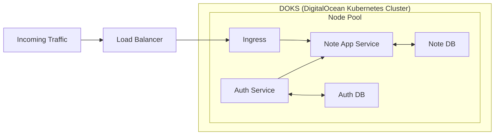

# Note App Microservices

This project is a comprehensive demonstration of a very minimalistic microservices architecture deployed in a cloud environment. It is
composed of two main services: `auth-service` and `note-app`.

The SaaS is accessible at [http://zvnico.fr/note-app](http://zvnico.fr/note-app). It is hosted on a DigitalOcean
Kubernetes Cluster.

## Table of Contents

- [Services](#services)
    - [Auth Service](#auth-service)
    - [Note App](#note-app)
- [The application features](#the-application-features)
- [Architecture](#architecture)
- [Running the application in local](#running-the-application-in-local)
- [DevOps](#devops)
- [Technologies](#technologies)

## Services

### Auth Service

The `auth-service` is a GRPC server that handles user registration, login, and token validation. It is built using
Node.js and grpc. More details about the `auth-service` can be found in its [README](auth-service/README.md).

### Note App

The `note-app` is responsible for handling the creation, reading, updating, and deletion of notes. More details about
the `note-app` can be found in its [README](note-app/README.md).

## The application features

This application allows users to:

- Register
- Login
- Logout
- Create notes
- View the list of notes
- View the details of a note
- Update notes
- Delete notes

If the user is not logged in, the notes will be saved in the local storage of the browser. If the user is logged in, the
notes will be saved in the database.

## Architecture

The following diagram illustrates the architecture of the application:



## Running the application in local

The application can be run locally using Docker and Docker Compose. The following steps are required to run the

1. Clone the repository:

```bash
git clone https://github.com/ZvNico/cloud-integration.git
```

2. Move into the `cloud-integration` directory:

```bash
cd cloud-integration
```

3. Run the application:

```bash
docker compose up
```

## DevOps

The DevOps pipelines are managed using GitHub Actions. The pipelines are defined in the `.github/workflows` directory.

There is a total of 6 pipelines:

- build-auth-service.yml:
    - Triggered when a push is made to the `auth-service` directory.
    - Builds the `auth-service` Docker image and pushes it to the GitHub Container Registry.
- build-note-app.yml:
    - Triggered when a push is made to the `note-app` directory.
    - Builds the `note-app` Docker image and pushes it to the GitHub Container Registry.
- deploy-auth-service.yml:
    - Triggered when the build-auth-service pipeline is successful.
    - Deploys the `auth-service` to the DigitalOcean Kubernetes Cluster
      using [auth-service.yaml](infra/k8s/auth-service.yaml).
- deploy-note-app.yml:
    - Triggered when the build-note-app pipeline is successful.
    - Deploys the `note-app` to the DigitalOcean Kubernetes Cluster using [note-app.yaml](infra/k8s/note-app.yaml).
- kubernetes-apply.yml:
    - Triggered when a push is made to the `infra/k8s/main.yaml` file.
    - Applies the Kubernetes configuration files in the [infra/k8s/main.yaml](infra/k8s/main.yaml) file.
- terraform-apply.yml:
    - Triggered when a push is made to the `infra/terraform/main.tf` file.
    - Applies the Terraform configuration in the [infra/terraform/main.yaml](infra/terraform/main.tf) file.

## Technologies

The following technologies are used in this project:

- Node.js
- gRPC
- Docker
- Kubernetes
- Terraform
- GitHub Actions
- DigitalOcean
- GitHub Container Registry
